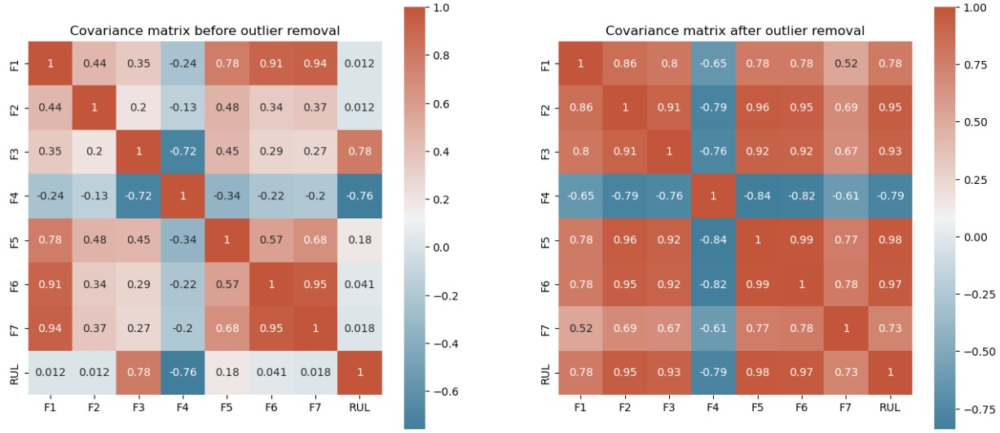

## Graduate Qualifying Project for the Data Science Course at BMSTU in Spring 2023 (11784DS)

In this grad project, I study the [RUL dataset](https://github.com/ignavinuales/Battery_RUL_Prediction) created by Ignacio Viñuales.

### Results

This is the covariance matrix before and after preprocessing:

This shows how classic regressors sometimes perform better than a neural network:

###

###

This is a diagram of my dense neural network trained on the RUL dataset:

###

###

This is a Windows desktop client for the neural network. I used Microsoft's latest [WinUI 3](https://learn.microsoft.com/en-us/windows/apps/winui/) framework and it is really cool. I also used the [cpr - C++ Requests library](https://docs.libcpr.org/) and C++20 [std::format](https://en.cppreference.com/w/cpp/utility/format/format) function which are both very helpful for those with Python background.

###

###

My [notebook](https://www.kaggle.com/code/peterlarin/data-cleaning-and-regressor-comparison) for this dataset on Kaggle.
