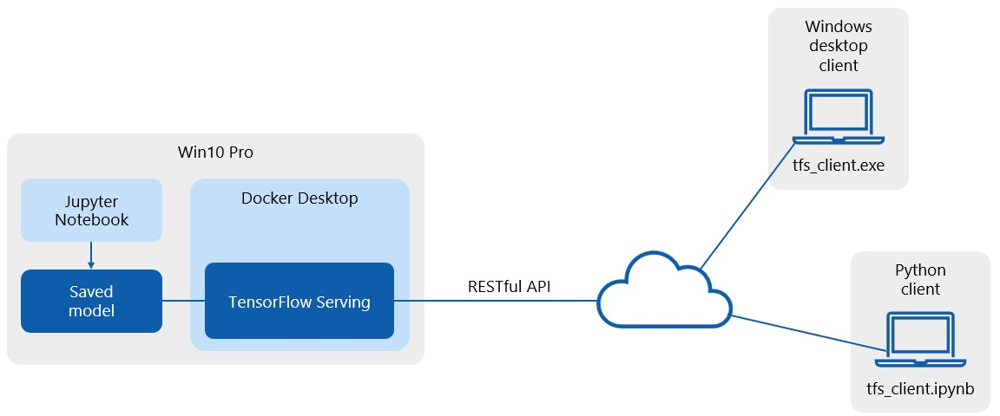
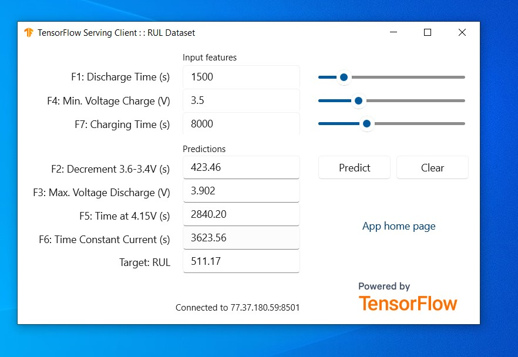

## Graduate Qualifying Project for the Data Science course at BMSTU in spring 2023 (11784DS)

This is a work in progress - check back soon! The final exam is on May 1st 2023.

###

In this grad project, I study the [RUL dataset](https://github.com/ignavinuales/Battery_RUL_Prediction) created by Ignacio Viñuales.

### Results

This shows how classic regressors sometimes perform better than a neural network:

###

###

This is how my app works:

###

###

This is my Windows desktop client app:

###

